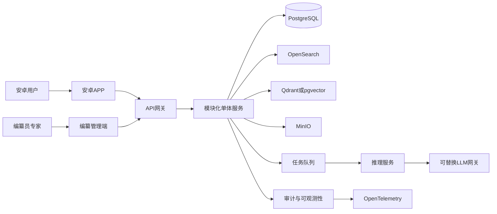
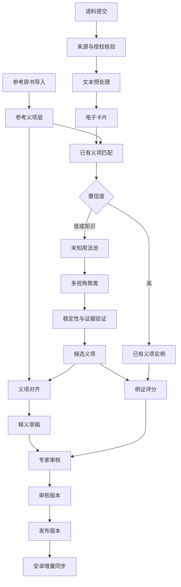
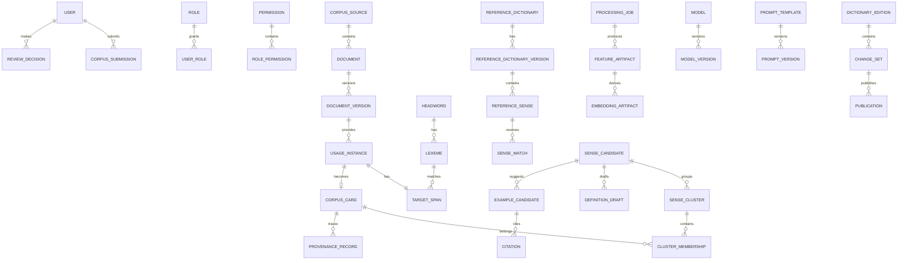
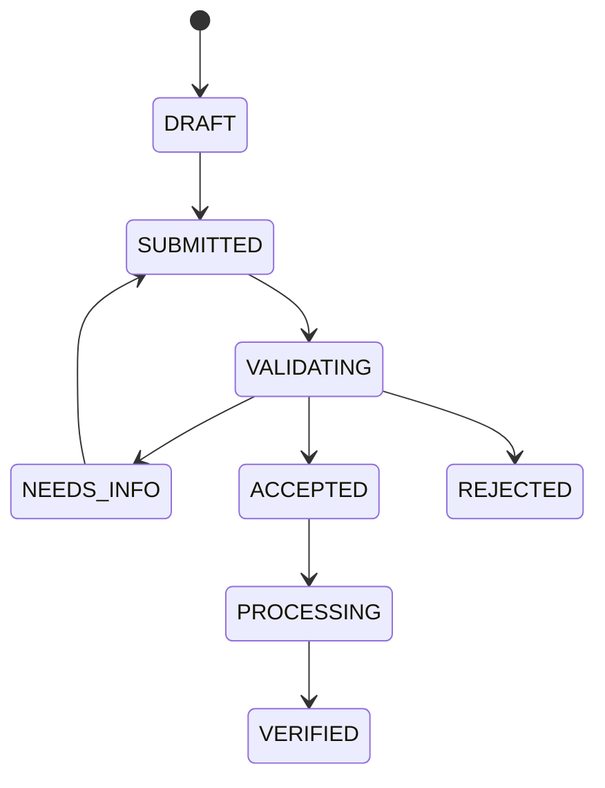
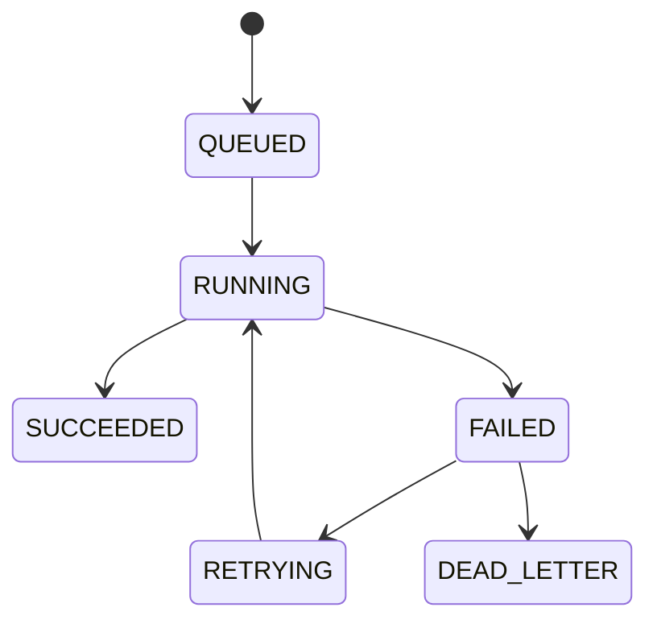
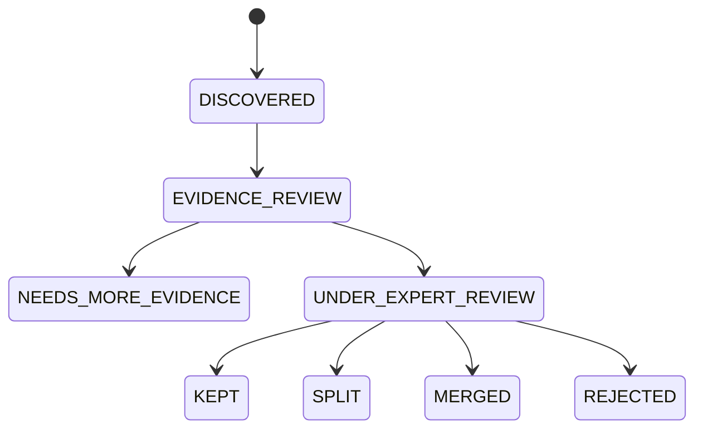
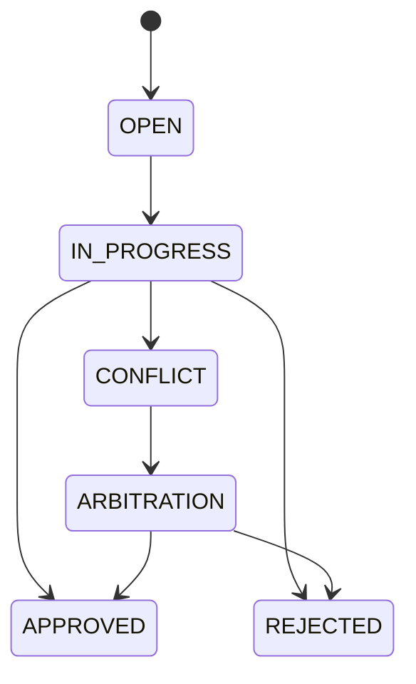

## 🤖 Assistant

# AI赋能的现代汉语字词义项自动发现与数字辞书编纂系统——完整技术路线

文档状态：假设、待组长确认、待专家确认、待法律确认、待实验验证并存
版本：V0.1 技术路线基线
项目阶段：MVP方案设计
适用范围：现代汉语书面语、单字字头与多字词条、专家参与的数字辞书编纂
重要原则：系统产生候选，不替代专家；用户投稿不直接进入正式辞书；所有正式内容必须可追溯、可审核、可回滚。

---

# 1. 执行摘要

本项目建设一套“语料接入—电子卡片—参考义项匹配—未知用法检测—候选义项聚类—释义草拟—例证筛选—专家审核—版本发布”的人机协同数字辞书系统。

系统不是让大语言模型凭空编写辞书，而是使用真实、合法、可核验的现代汉语语料辅助专家发现用法差异、组织证据、提出候选义项并生成受证据约束的释义草稿。该定位与项目调研报告中提出的“AI辅助专家从真实语料中发现用法差异、归纳候选义项、生成释义草案，并经过专家校验形成数字辞书资源”一致。[^2]

最终技术路线采用：

```text
授权参考辞书导入
→ 参考义项和释义知识建模
→ 目标字词及目标跨度识别
→ 目标词级上下文表示
→ 掩码语言模型词汇替换表示
→ 搭配、句法、语体、领域特征融合
→ 已知义项半监督匹配
→ 开放集未知用法拒绝
→ HDBSCAN/层次聚类
→ 聚类稳定性与多来源证据验证
→ 跨时间片义项对齐
→ 证据包驱动的释义草拟
→ 真实语料例证检索与评分
→ 专家拆分、合并、修订、否决
→ 版本发布和安卓端增量同步
```

项目第一阶段以“打、开、发、上、下”等多义明显、语料较丰富且辞书义项相对清晰的目标为实验对象，每个目标字词抽取约200—500条例句，用于跑通最小闭环。[^1] [^2]

系统采用模块化单体作为MVP后端，Rust/Axum/Tokio/SQLx负责业务服务，独立推理服务负责批量模型任务；PostgreSQL保存事务数据和版本数据，向量检索采用Qdrant或PostgreSQL向量扩展，全文检索采用OpenSearch，对象存储采用MinIO。安卓端采用Kotlin、Jetpack Compose、Room和WorkManager；编纂端采用TypeScript、SvelteKit和TanStack Query。

---

# 2. 项目背景与问题定义

传统辞书编纂流程为：

```text
语料
→ 抄卡片
→ 卡片整理归类
→ 拟定义项
→ 撰写释义与例证
→ 辞书
```

本项目将其数字化，但保留专家对义项边界、释义规范、例证合法性和最终发布的决定权。

系统需要解决以下问题：

1. 如何从真实现代汉语语料中定位目标字或目标词。
2. 如何区分字头、词条、目标文本跨度、语素义和整词义。
3. 如何将语料实例与参考辞书已有义项对齐。
4. 如何拒绝无法可靠归类的实例，而不是强行分类。
5. 如何从低置信度和未知用法中发现候选新义项。
6. 如何区分新义项、低频噪声、主题差异、文体差异和作者个体用法。
7. 如何为候选义项提供可复核的语料证据。
8. 如何生成不创造来源、不伪造例证的释义草稿。
9. 如何由专家执行拆分、合并、修订、否决和发布。
10. 如何形成从正式义项到原始语料和来源授权的完整数据血缘。

系统只能陈述：

- “当前证据集中的最早见例”；
- “目前可核验的最早见例”。

系统不得在没有充分历时语料支持的情况下声称某义项在语言史上的绝对首次出现时间。

---

# 3. 对组长要求的逐条解释

| 要求 | 系统解释 | 状态 |
|---|---|---|
| 以真实语料为基础 | 所有候选义项必须关联真实使用实例和来源记录 | 已确认 |
| 参考辞书不可缺少 | 参考辞书提供初始义项、释义、例证和义项ID | 已确认 |
| AI不能替代专家 | 模型输出只能进入候选、草稿或辅助层 | 已确认 |
| 重点处理现代汉语书面语 | MVP不强制覆盖古汉语、方言、语音和大规模OCR | 已确认 |
| 需要发现新义项 | 建立开放集拒识、聚类、稳定性和证据评分机制 | 已确认 |
| 结果必须可解释 | 展示代表卡片、搭配、句法、来源、时间和模型置信度 | 已确认 |
| 用户可以投稿 | 投稿进入隔离区，必须经来源核验和专家审核 | 已确认 |
| 采用指定工程方向 | 优先采用Rust、Kotlin、SvelteKit、PostgreSQL等 | 待实验验证 |
| 不以SenseForge主路线为核心 | Mutual kNN + Leiden只作为对比基线 | 已确认 |
| 文件、数据和模型需可追溯 | 每个特征、推理、模型、提示模板和审核决策绑定版本 | 已确认 |

---

# 4. 术语、概念和缩略语

| 术语 | 定义 |
|---|---|
| 字头 | 辞书中作为独立检索入口的汉字单位 |
| 词条 | 辞书中作为整体收录的词或固定表达 |
| Lexeme | 抽象词汇单位，可对应一个或多个词形 |
| 目标跨度 | 原始文本中实际参与分析的字符区间 |
| 语素义 | 字在多字词中的构词意义 |
| 词汇义 | 整个词在具体上下文中的意义 |
| 固定搭配义 | 习语、成语或固定结构的整体意义 |
| Usage Instance | 一条目标字词在上下文中的实际使用 |
| WSD | Word Sense Disambiguation，词义消歧 |
| WSI | Word Sense Induction，词义归纳 |
| WiC | Word-in-Context，词在上下文中的意义判断 |
| GDEX | Good Dictionary Examples，优良辞书例句 |
| Open-set | 允许输入属于未知类别 |
| Unknown | 无法可靠映射到现有义项的实例 |
| Sense Candidate | 候选义项 |
| Sense Cluster | 语料实例聚成的候选义项簇 |
| Provenance | 数据来源、处理过程和证据链 |
| Coverage-risk | 在不同覆盖率下观察错误风险的曲线 |

---

# 5. 项目目标、非目标和边界

## 5.1 目标

- 建立现代汉语字词义项发现和编纂的数字化闭环。
- 导入合法授权的参考辞书数据。
- 支持用户提交语料及完整来源信息。
- 自动生成电子卡片。
- 提供已有义项匹配和未知用法发现。
- 产生可解释、可追溯的候选义项。
- 生成受证据包约束的释义草稿。
- 优先从真实语料中筛选例证。
- 支持专家审核、双人复核、仲裁和版本发布。
- 支持安卓离线查询和增量同步。

## 5.2 非目标

- 不自动发布未经专家审核的辞书内容。
- 不在MVP中覆盖古汉语、方言、语音数据。
- 不在MVP中建设大规模扫描文献OCR流水线。
- 不默认抓取或存储无授权网页全文。
- 不将具体闭源LLM写死为不可替换依赖。
- 不以通用句向量直接替代目标词级语义建模。
- 不将聚类结果直接等同于语言学意义上的正式义项。

## 5.3 边界

| 范围 | MVP |
|---|---|
| 语言 | 现代汉语书面语 |
| 分析单位 | 单字、常见多字词、固定搭配 |
| 用户端 | 安卓APP |
| 管理端 | 编纂和专家管理平台 |
| 模型 | 中文Transformer、BGE/text2vec/SimCSE类模型作为候选基线 |
| 数据量 | 小规模可授权样本，目标词每个200—500条例句 |
| 发布 | 内部试用版和审核版 |
| 存储 | 原文、结构化字段、向量和审计记录分层保存 |

---

# 6. 利益相关者与角色

| 角色 | 职责 |
|---|---|
| 普通用户 | 查询辞典、提交语料、提交反馈 |
| 投稿者 | 提交文本、来源和授权信息 |
| 语料管理员 | 核验来源、版权和数据质量 |
| 编纂员 | 整理卡片、编辑义项、筛选例证 |
| 语言学专家 | 判断义项边界、释义规范和年代证据 |
| 仲裁专家 | 处理双人审核分歧 |
| 模型工程师 | 训练、推理、校准和评测模型 |
| 数据治理负责人 | 管理数据分类、血缘、质量和保留策略 |
| 法务/版权负责人 | 审查辞书、语料、例证和模型训练授权 |
| 安全管理员 | 管理身份、权限、审计和安全事件 |
| 发布管理员 | 执行版本审批、签名、发布和回滚 |
| 运维人员 | 监控、备份、恢复和故障处理 |
| 项目负责人 | 决策范围、资源、里程碑和风险 |

---

# 7. 用户场景和业务用例

## UC-001 字词查询

用户输入字词、拼音或模糊检索条件，系统返回正式发布版本中的字头、词条、义项、例证、来源和年代说明。

## UC-002 语料投稿

用户提交原文、目标字词、上下文及来源信息，系统保存草稿并执行格式、恶意内容、重复和授权状态检查。

## UC-003 卡片核验

语料管理员查看原始文本、目标跨度、来源元数据、版权状态和系统质量评分，决定通过、退回或要求补充。

## UC-004 已有义项匹配

系统为电子卡片召回参考辞书义项并给出排序、置信度和拒识结果。

## UC-005 候选新义项发现

系统从未知或低置信度实例中形成候选簇，展示代表例句、搭配、来源分布、时间分布和与已有义项的距离。

## UC-006 专家编纂

专家可拆分、合并、修改或否决候选义项，编辑释义和例证，并记录理由。

## UC-007 版本发布

发布管理员在双人复核完成后发布辞书版本，生成变更集、内容摘要和同步包。

## UC-008 用户反馈闭环

用户报告错误或补充例证，反馈经审核后进入困难样本池、数据集版本和后续模型训练流程。

---

# 8. 功能需求

所有功能需求均采用“系统必须……”表述。

| 编号 | 需求 |
|---|---|
| FR-001 | 系统必须支持按字头、词条、拼音、模糊拼写和简繁形式检索正式辞书内容。 |
| FR-002 | 系统必须支持手工、文件和批量方式提交语料。 |
| FR-003 | 系统必须保存投稿原文、目标跨度、上下文、来源、时间和授权状态。 |
| FR-004 | 系统必须在投稿进入处理流水线前执行幂等校验和恶意内容检查。 |
| FR-005 | 系统必须将原始文本以不可变对象保存。 |
| FR-006 | 系统必须支持繁简、异体字和Unicode规范化策略的版本绑定。 |
| FR-007 | 系统必须自动识别目标字词候选跨度，并允许人工修正。 |
| FR-008 | 系统必须生成带唯一ID的电子卡片。 |
| FR-009 | 系统必须区分字头、词条、目标跨度、语素义和词汇义。 |
| FR-010 | 系统必须支持参考辞书、版本、义项和原始义项ID导入。 |
| FR-011 | 系统必须为每个语料实例召回多个参考义项候选。 |
| FR-012 | 系统必须支持unknown拒绝，不得强制所有实例归入已有义项。 |
| FR-013 | 系统必须从低置信度、拒识和异常实例建立未知用法候选池。 |
| FR-014 | 系统必须支持HDBSCAN和层次聚类，并保存参数和随机种子。 |
| FR-015 | 系统必须计算聚类稳定性、最小支持度和多来源证据。 |
| FR-016 | 系统必须展示候选簇与已有义项的相似度和重叠情况。 |
| FR-017 | 系统必须生成包含证据引用的释义草稿。 |
| FR-018 | 系统必须优先从真实语料中筛选辞书例证。 |
| FR-019 | 系统必须支持卡片级、候选义项级和版本级专家审核。 |
| FR-020 | 系统必须支持候选义项保留、拆分、合并、修订、否决和待确认。 |
| FR-021 | 系统必须支持双人复核和分歧仲裁。 |
| FR-022 | 系统必须阻止未经审核的内容进入正式发布版本。 |
| FR-023 | 系统必须生成版本差异、变更集、内容摘要和回滚点。 |
| FR-024 | 系统必须支持安卓端离线查询和增量同步。 |
| FR-025 | 系统必须记录模型、特征、提示模板和数据版本。 |
| FR-026 | 系统必须支持用户反馈进入审核和主动学习流程。 |
| FR-027 | 系统必须为所有关键操作生成审计记录。 |

---

# 9. 非功能需求

| 编号 | 需求 |
|---|---|
| NFR-001 | 系统必须保证原始语料对象和正式辞书内容具有稳定唯一标识。 |
| NFR-002 | 系统必须保证正式发布内容可回滚至上一签名版本。 |
| NFR-003 | 系统必须对模型推理、数据处理和审核任务提供可观测性。 |
| NFR-004 | 系统必须支持任务重试、幂等执行和失败恢复。 |
| NFR-005 | 系统必须支持分页、筛选和排序，避免一次性返回大规模结果。 |
| NFR-006 | 系统必须对个人信息、版权敏感字段和原文全文实施分级访问。 |
| NFR-007 | 系统必须支持模型、规则、特征和数据集的版本回溯。 |
| NFR-008 | 系统必须在相同输入、模型版本、参数和随机种子下提供可复现实验输出。 |
| NFR-009 | 系统必须支持无障碍展示、字体缩放和屏幕阅读辅助。 |
| NFR-010 | 系统必须具备备份、恢复演练和灾难恢复方案。 |
| NFR-011 | 系统必须支持替换向量库、LLM网关和推理运行时。 |
| NFR-012 | 系统必须避免没有业务依据的大规模微服务拆分。 |

---

# 10. 业务规则

| 编号 | 规则 |
|---|---|
| BR-001 | 用户投稿内容不得直接成为正式辞书内容。 |
| BR-002 | 正式义项必须具有审核决策、责任人和版本记录。 |
| BR-003 | 例证必须具备来源或明确标记为待核验。 |
| BR-004 | 未经充分历时语料检索，系统不得输出“绝对首次出现”。 |
| BR-005 | 目标跨度必须记录字符起止位置和识别方式。 |
| BR-006 | 多字词整体义不得自动拆解为字在词中的语素义。 |
| BR-007 | 单字命中多字词时，系统必须同时保存字级命中和词级命中。 |
| BR-008 | 候选新义项至少应满足最小实例数、多来源或专家豁免条件。 |
| BR-009 | 同一作者、同一作品或同一网页的大量重复实例不得单独证明新义项。 |
| BR-010 | 时间、作者、领域和文体分布必须作为偏差诊断信息，不得直接作为义项标签。 |
| BR-011 | LLM不得生成未在证据包中出现的来源、作者、日期或例句。 |
| BR-012 | 释义草稿必须标注模型版本、提示模板和证据包版本。 |
| BR-013 | 关键审核操作必须由具有相应权限的人员完成。 |
| BR-014 | 发布版本必须具有内容摘要、发布审批和回滚点。 |

---

# 11. 传统辞书流程到系统流程的映射

| 传统环节 | 系统模块 | AI作用 | 人工不可替代内容 |
|---|---|---|---|
| 语料阅读 | 语料接入和检索 | 召回、过滤、去重 | 来源和授权判断 |
| 抄卡片 | 电子卡片 | 自动生成结构化卡片 | 目标跨度修正 |
| 卡片整理归类 | 匹配和聚类 | 表示、匹配、聚类 | 义项边界判断 |
| 拟定义项 | 候选义项 | 证据汇总和新义项评分 | 保留、拆分、合并、否决 |
| 撰写释义 | 释义草拟 | 基于证据生成草稿 | 语言规范和最终表述 |
| 撰写例证 | 例证筛选 | 真实性、典型性和多样性评分 | 合法性和编纂适用性 |
| 辞书发布 | 版本管理 | 差异生成和同步 | 审批、签名、发布 |

---

# 12. 国内外研究现状

## 12.1 语料驱动辞书编纂

项目已有调研认为，现代辞书系统应采用“真实语料+BCC/CCL+语义知识+传统辞书人工参考”的组合路线。[^2] 语料驱动方法能够观察真实搭配、语体和用法分布，但其结果仍需经过辞书学判断。

## 12.2 词义消歧与词义归纳

WSD依赖预先定义的义项库存；WSI则从使用实例中归纳潜在义项。替换词集合能够提供比整句向量更接近“可替换意义”的解释特征；相关研究显示，基于掩码语言模型生成词汇替换并进行聚类，是可作为本项目对照和增强的路线之一。[^7]

## 12.3 开放集未知用法和语义变化

AXOLOTL-24将未知新义项识别与字典式释义生成结合，说明新义项检测不能只评价聚类，还应评价是否被既有辞书覆盖以及是否能给出解释。[^7] 本项目将其思想迁移到现代汉语，但中文数据、辞书体系和时间切片需单独验证。

## 12.4 释义生成和例证生成

已有研究将上下文使用簇转化为可解释的自然语言定义，并选择簇内代表性定义作为义项标签。[^7] 但LLM生成例句和释义存在幻觉、事实错误、来源伪造和低资源语言性能下降风险，因此本项目只允许检索增强、证据约束和专家审核。

## 12.5 中文语义资源

OpenHowNet提供基于义原的中文词汇语义知识，并包含词、义项、义原和API等组成部分，可作为参考义项、语义关系和候选召回资源。[^5] 但其义项体系不等同于项目采用的授权权威辞书体系，且单字映射、覆盖范围和许可证需要单独核验。

---

# 13. 语料、辞书、数据集和工具资源调研

| 资源 | 用途 | 优势 | 局限和待核验 |
|---|---|---|---|
| 授权现代汉语辞书 | 参考义项、释义、例证 | 与最终编纂体系一致 | 版权、字段授权、训练授权待法律确认 |
| BCC | 现代汉语上下文、频次、搭配 | 规模大、现代汉语覆盖广 | 下载、接口、批量使用和版权需核验 |
| CCL | 现代与历史语料补充 | 可作时代和文体对照 | 自动化和批量访问能力需核验 |
| OpenHowNet | 义原、语义关系、候选匹配 | 可程序调用 | 与权威辞书义项不完全一致 |
| Chinese Open Wordnet | 同义、上下位关系 | 可辅助语义网络 | 覆盖、一致性和许可证待确认 |
| Chinese PropBank | 谓词论元和句法语义特征 | 可辅助搭配和句法分析 | 许可和与现代辞书单位的映射待确认 |
| OntoNotes Chinese | 语义角色、命名实体等 | 可作辅助标注资源 | 不以辞书义项为核心 |
| 公开新闻/维基文本 | MVP补充语料 | 易获取、便于工程试验 | 不能替代权威授权语料 |
| 中文BERT | 目标上下文表示基线 | 生态成熟 | 需要目标跨度池化和中文切词处理 |
| BGE/text2vec/SimCSE | 检索和句向量基线 | 可快速建立基线 | 通用句向量不等于词义表示 |
| HDBSCAN | 开放集聚类 | 不要求预先指定簇数，可识别噪声 | 参数敏感、小簇稳定性需验证 |
| 层次凝聚聚类 | 义项树状组织 | 便于专家查看和拆分 | 距离阈值和链接方式影响结果 |
| LLM网关 | 释义草拟和解释 | 语言表达能力强 | 幻觉、版权、成本和可替换性风险 |

资源导入必须记录：

- 资源名称；
- 资源版本；
- 来源URL或本地路径；
- 获取日期；
- 许可证；
- 使用范围；
- 是否允许全文存储；
- 是否允许模型训练；
- 是否允许生成例证；
- 是否允许对外发布；
- 责任人；
- 法律核验状态。

---

# 14. 关键论文证据表

以下表格区分“已由检索摘要确认”和“待全文核验”。检索到的部分研究仅可支持方向性结论，不能在未读全文时用于声称具体实验数值。

| source_id | 主题 | 证据 | 关联结论 | 状态 |
|---|---|---|---|---|
| P-001 | Towards better substitution-based WSI | 使用BERT改进替换词型WSI，并支持动态簇数 | 词汇替换可作为目标词语义特征 | 需核验全文 |
| P-002 | Large Scale Substitution-based WSI | 使用预训练掩码语言模型生成替换词并扩展规模 | 可作为替换集合增强路线 | 需核验全文 |
| P-003 | OpenHowNet | 公开义原词汇知识库和API | 可作为中文参考语义层 | 摘要已确认，细节待核验 |
| P-004 | Chinese Word Sense Embedding with SememeWSD | 结合OpenHowNet和WSD构造中文词义表示 | 可作为中文语义知识增强参考 | 需核验全文 |
| P-005 | AXOLOTL-24 | 任务包含未知新义项识别和字典式释义 | 支持开放集检测和解释联合评测 | 摘要已确认 |
| P-006 | Presence or Absence | 比较检测到的新义项是否被辞书覆盖 | 支持“新用法—辞书覆盖”对照 | 需核验全文 |
| P-007 | Interpretable Word Sense Representations via Definition Generation | 使用使用簇生成定义并选取代表定义 | 支持解释性释义草拟 | 需核验全文 |
| P-008 | Generating bilingual example sentences with LLMs | 用GDEX标准评价生成例句，低资源场景性能会下降 | 例证生成不能替代真实语料检索 | 摘要已确认 |
| P-009 | SenseForge | 项目材料给出“Sentence Embedding→Mutual kNN Semantic Graph→Leiden→LLM Refinement”的公开主路线 | 作为对比基线 | 仓库代码待核验 |
| P-010 | Corpus-Based WSD | 语料实例和辞书义项相似度可用于消歧 | 支持参考义项匹配 | 需核验全文 |

参考链接：

- [P-001](https://arxiv.org/abs/1905.12598)
- [P-002](https://arxiv.org/abs/2110.07681)
- [P-003](https://arxiv.org/abs/1901.09957)
- [P-004](https://arxiv.org/abs/2206.14388)
- [P-005](https://arxiv.org/abs/2407.04079)
- [P-006](https://arxiv.org/abs/2406.00656)
- [P-007](https://arxiv.org/abs/2305.11993)
- [P-008](https://arxiv.org/abs/2410.03182)
- [P-010](https://arxiv.org/abs/cmp-lg/9804004)

---

# 15. SenseForge可验证架构分析

项目材料给出的SenseForge路线为：

```text
Sentence Embedding
→ Mutual kNN Semantic Graph
→ Leiden Community Detection
→ Candidate Sense Communities
→ LLM Sense Refinement
→ Sentence-level Sense Reclassification
→ Structured Dictionary
→ Evaluation
```

该路线目前可以作为项目提供材料中的公开主路线描述。[用户提供材料；引用编号待仓库全文核验]

## 15.1 必须核查的仓库证据

| 核查项 | 核查方法 | 结论状态 |
|---|---|---|
| 目录结构 | 阅读仓库树和主要源文件 | 待核验 |
| 依赖 | requirements、pyproject、环境文件 | 待核验 |
| 模型 | 查找模型名称、下载配置和推理代码 | 待核验 |
| 聚类 | 查找kNN、Leiden参数和调用位置 | 待核验 |
| 输入格式 | README、样例数据和解析器 | 待核验 |
| 输出格式 | 结构化结果、JSON或报告文件 | 待核验 |
| 数据集 | 查找数据来源、样例和许可 | 待核验 |
| 评测 | 指标、测试脚本和结果 | 待核验 |
| GUI/API | 查找前端、路由、服务端入口 | 待核验 |
| 数据库 | 查找持久化层和迁移脚本 | 待核验 |
| 参考辞书接入 | 查找义项库存和gloss匹配 | 待核验 |
| 来源追溯 | 查找source、citation、provenance字段 | 待核验 |
| 权限审核 | 查找用户、角色、review和审计 | 待核验 |
| 移动端 | 查找Android或移动端代码 | 待核验 |

## 15.2 可合理推断的优势

- 路线清晰，适合快速建立从句子嵌入到候选簇的原型。
- 图社区发现能够处理不预设固定簇数的场景。
- LLM refinement便于将簇结果转换为可读标签。
- 句子级重新分类有助于形成结构化输出。

这些属于方法路线层面的推论，不代表仓库一定已经实现全部能力。

## 15.3 本项目不能直接照搬的原因

- 通用句向量可能掩盖目标词的局部语义。
- 图构建和社区发现对k值、相似度、分辨率参数敏感。
- 社区簇不天然等于辞书义项。
- 缺少参考辞书约束时，已有义项识别能力不足。
- 需要开放集拒识、来源追溯、权限审核和版本发布。
- LLM refinement必须受证据包约束。
- 移动端、离线同步、版权隔离和正式发布治理需要完整工程系统支持。

本方案将其作为可复现实验基线，不将Mutual kNN + Leiden作为主算法。

---

# 16. 我方差异化竞争策略

1. 以“参考辞书义项建模+开放集未知检测”为核心，而不是先聚类再解释。
2. 使用目标词级、多视角上下文表示，而不是只使用整句Embedding。
3. 引入掩码语言模型词汇替换集合，增强可解释的替换语义。
4. 融合搭配、句法、词性、语体、领域和来源分布，但进行作者、主题和文体去偏。
5. 使用已知义项半监督匹配和unknown拒绝。
6. 使用HDBSCAN、层次聚类和稳定性分析，不以Mutual kNN + Leiden作为主路线。
7. 将低频噪声、多来源证据、时间集中度和跨作者分布纳入新义项评分。
8. 释义生成必须绑定证据包并返回引用。
9. 例证优先从真实语料筛选，不默认生成。
10. 将数据血缘、版权、审核、版本和发布作为一等功能。

---

# 17. 候选技术路线比较

| 方法 | 优点 | 缺点 | 决策 |
|---|---|---|---|
| 整句Embedding | 简单、快速 | 主题和文体信号过强 | 仅基线 |
| 目标token池化 | 突出目标词 | 多字词边界和分词较复杂 | 采用 |
| 多token跨度池化 | 适合多字词 | 需要可靠跨度 | 采用 |
| 左右窗口表示 | 易解释 | 可能丢失远程信息 | 作为视图 |
| Gloss嵌入 | 可解释、可对齐辞书 | 依赖参考辞书质量 | 采用 |
| 词汇替换集合 | 接近可替换语义 | 受MLM质量和上下文影响 | 采用 |
| 搭配/句法特征 | 对义项边界有帮助 | 标注误差和稀疏问题 | 采用 |
| KMeans | 易复现 | 必须指定K，不能识别噪声 | 弱基线 |
| HDBSCAN | 可识别噪声和变密度簇 | 参数敏感 | 主方案之一 |
| 层次聚类 | 便于专家拆分和合并 | 阈值选择影响较大 | 主方案之一 |
| 高斯混合 | 可输出概率 | 对分布假设敏感 | 对比 |
| DP Mixture | 可推断簇数 | 训练和解释成本高 | 研究备选 |
| 谱聚类 | 可处理非凸结构 | 计算和参数成本高 | 对比 |
| 受约束聚类 | 可融入专家约束 | 需要可靠约束 | 审核后重聚类 |
| 原型分类 | 已有义项匹配直接 | 对未知义项能力弱 | 已知义项匹配 |
| 能量/距离阈值 | 可做unknown拒绝 | 阈值校准要求高 | 采用 |
| Conformal Prediction | 提供覆盖率控制 | 需要校准集且假设较强 | 研究备选 |
| LLM直接分类 | 语言解释自然 | 成本、幻觉和一致性风险 | 不作为主分类器 |
| LLM辅助解释 | 编纂价值高 | 必须受证据约束 | 采用 |

---

# 18. 最终技术路线及选择理由

## 18.1 核心决策

- 参考义项匹配采用“召回模型+重排序模型+拒识阈值”。
- 新义项发现采用“未知池+多视角特征+HDBSCAN/层次聚类+稳定性验证”。
- 释义采用“结构化证据包+可替换LLM网关”。
- 例证采用“真实语料检索+多指标评分”。
- 专家拥有最终决定权。
- MVP采用模块化单体，长任务和GPU推理可独立部署。

## 18.2 为什么不能只使用通用句向量

整句向量同时编码主题、作者、文体、篇章和情绪。两个句子可能因为同一主题相似，却对目标词表达不同意义；也可能因为文体不同而被错误分开。因此系统必须突出目标字词或多字词跨度，并将句子级信息作为辅助视图，而不是唯一表示。

## 18.3 中文分词错误处理

系统保留字符级、词级和目标跨度三级表示：

```text
原始文本
→ 字符偏移
→ 分词结果
→ 目标字/词候选跨度
→ 人工确认跨度
```

对于“打电话”中的“打”，系统记录：

- 字头：打；
- 词条：打电话；
- 目标跨度：字符区间；
- 词内语素角色：动词语素；
- 词汇义：整词“进行电话通信”的意义。

---

# 19. 系统上下文和总体架构



## 19.1 组件通信

- 客户端通过HTTPS调用REST API。
- 长任务通过任务队列异步执行。
- 事务状态写入PostgreSQL。
- 原始文件、模型和导出包写入MinIO。
- 全文检索使用OpenSearch。
- 向量检索使用Qdrant或pgvector。
- 推理服务通过内部鉴权接口访问模型。
- LLM网关屏蔽具体模型供应商。
- 所有任务使用数据版本、模型版本和特征版本绑定。

---

# 20. 模块划分和模块职责

| 模块 | 职责 |
|---|---|
| Identity | OIDC、用户、角色、权限 |
| Corpus Ingestion | 投稿、文件导入、幂等和授权 |
| Source Verification | 来源解析、书目核验、版权状态 |
| Text Processing | 编码、规范化、分句、分词、目标跨度 |
| Card Management | 电子卡片、人工批注、质量评分 |
| Dictionary Import | 参考辞书导入和版本隔离 |
| Sense Matching | 已有义项召回、重排和拒识 |
| Sense Discovery | 未知用法池、聚类和稳定性 |
| Diachronic Analysis | 时间切片和义项对齐 |
| Definition Drafting | 证据包和释义草拟 |
| Example Ranking | 真实例证筛选和评分 |
| Review | 专家审核、双人复核和仲裁 |
| Publication | 版本、变更集、签名、发布、回滚 |
| Search | 字词、全文、向量和组合检索 |
| Sync | 安卓离线包和增量同步 |
| Model Registry | 模型、特征、提示模板和评测 |
| Audit | 审计、追踪和合规导出 |

---

# 21. 完整端到端数据流程



---

# 22. 语料接入和来源核验

## 22.1 必填字段

- submission_id；
- 原始文本或文件；
- 目标字词；
- 投稿者；
- 提交时间；
- 来源类型；
- 来源描述；
- 授权状态声明；
- 用户协议确认；
- 内容完整性摘要。

## 22.2 可选字段

- 上下文；
- 作者；
- 作品名称；
- 报刊、书籍、网页或数据库名称；
- 出版机构；
- 出版日期；
- 卷期、版次、页码；
- URL；
- ISBN、ISSN、DOI；
- 访问日期；
- 语体、领域、地域；
- 来源原文片段；
- 版权限制。

## 22.3 来源核验结果

- verified；
- partially_verified；
- unverifiable；
- rejected；
- legal_review_required。

系统不得将“URL可访问”直接视为“可存储、可训练、可发布”。

---

# 23. 文本清洗和目标跨度识别

处理步骤：

1. 保存原始字节和摘要。
2. 检测编码。
3. 执行Unicode规范化。
4. 根据处理版本进行繁简和异体处理。
5. 分句。
6. 字符级扫描目标字词。
7. 分词和词性标注。
8. 识别词内命中和独立命中。
9. 生成左右上下文窗口。
10. 执行精确重复和近重复检测。
11. 执行低质量、广告、乱码、敏感信息和提示词注入检测。
12. 输出处理质量报告。

目标跨度必须保存：

```json
{
  "start_char": 12,
  "end_char": 16,
  "surface": "打电话",
  "target_headword": "打",
  "target_lexeme": "打电话",
  "match_type": "multi_character_lexeme",
  "detector": "dictionary_plus_char_scan",
  "human_verified": false
}
```

---

# 24. 电子卡片模型

电子卡片是从语料到义项的最小可审计证据单元。

必须包括：

- card_id；
- usage_instance_id；
- 原文；
- 左上下文；
- 右上下文；
- 目标跨度；
- 字头；
- 词条；
- 词性；
- 来源；
- 时间；
- 作者；
- 语体；
- 领域；
- 权利状态；
- 质量评分；
- 重复组；
- 处理版本；
- 特征版本；
- 人工批注；
- 当前状态；
- 数据血缘。

卡片状态：

```text
DRAFT
→ PROCESSING
→ NEEDS_VERIFICATION
→ VERIFIED
→ MATCHED
→ CLUSTERED
→ REVIEWED
→ ARCHIVED
```

---

# 25. 参考辞书导入与义项建模

导入流程：

```text
授权检查
→ 原始文件隔离保存
→ 格式解析
→ 字头和词条规范化
→ 拼音、词性、释义、例证、标签导入
→ 原始义项ID保留
→ 导入校验
→ 生成参考辞书版本
→ 版权隔离
```

参考义项必须区分：

- 原始辞书义项；
- 系统规范化义项；
- 义项原型；
- 义项关系；
- 义项示例；
- 义项来源；
- 义项可公开字段；
- 义项版权敏感字段。

参考辞书数据不得与用户投稿数据混存于无权限隔离的公开索引中。

---

# 26. 上下文语义表示

## 26.1 输入

- 目标字词；
- 目标跨度；
- 原始句；
- 左右窗口；
- 分词和词性；
- 搭配；
- 句法关系；
- 语体、领域和时间；
- 参考义项释义和例证。

## 26.2 表示视图

```text
h_target = Pool(hidden states of target span)
h_sentence = Pool(hidden states of sentence)
h_window = Pool(left and right context)
h_gloss = Encode(reference gloss)
h_substitute = Encode(MLM substitute distribution)
h_syntax = Encode(collocation and dependency features)
```

融合表示：

\[
h = W_t h_{target} + W_s h_{sentence} + W_w h_{window}
+ W_g h_{gloss} + W_r h_{substitute} + W_x h_{syntax}
\]

权重可通过验证集学习，也可先固定并执行消融实验。

## 26.3 目标跨度池化

- 单字：取目标字符对应token的加权平均。
- 多字词：取跨度内全部token的注意力加权平均。
- 分词失败：回退到字符级窗口和候选跨度编码。
- 多个候选跨度：分别计算并由规则或人工确认。
- 目标词被切入更长词：同时保留字级和词级实例。

## 26.4 去偏

为避免按主题、作者、年代或文体聚类：

- 计算并记录主题、作者、来源和文体特征；
- 对表示执行残差化或对抗去偏实验；
- 评估簇与作者、来源、时间的互信息；
- 若簇高度由来源或作者解释，则标记为偏差风险；
- 不删除时间和来源字段，而是将其用于诊断和证据分析。

---

# 27. 已有义项匹配

## 27.1 问题定义

给定目标字词使用实例 \(u\) 和参考义项集合 \(S=\{s_1,\ldots,s_n\}\)，输出top-k义项及其概率；当所有义项相似度不足或不确定性过高时输出unknown。

## 27.2 义项原型

每个参考义项由以下内容编码：

```text
prototype(s) =
  gloss embedding
  + reference example embeddings
  + synonyms
  + part of speech
  + sememe or semantic relation features
```

原型可采用加权中心：

\[
p_s = \alpha e_{gloss}
+ \beta \operatorname{mean}(e_{examples})
+ \gamma e_{relations}
\]

## 27.3 匹配步骤

1. 使用向量检索召回top-N候选义项。
2. 使用cross-encoder或等价重排序模型计算实例—义项匹配分数。
3. 使用校准集校准概率。
4. 根据绝对阈值、相对间隔和不确定性执行拒识。
5. 返回top-k和unknown原因。

伪代码：

```python
def match_usage(usage, senses, retriever, reranker, calibrator, threshold):
    candidates = retriever.retrieve(usage.embedding, top_n=20)
    scored = reranker.score_pairs(usage.text, candidates)
    probs = calibrator.transform(scored)
    best = max(probs, key=lambda x: x.probability)
    margin = best.probability - sorted(probs)[-2].probability
    if best.probability < threshold or margin < 0.05:
        return {"label": "unknown", "candidates": probs}
    return {"label": best.sense_id, "candidates": probs}
```

## 27.4 训练方式

- 专家标注的实例—义项对作为正例。
- 相邻义项、同词不同义项作为难负例。
- 参考辞书例证作为弱监督。
- 使用对比学习或交叉编码器训练。
- 训练、验证和测试按文献、作者或时间分组，避免泄漏。

## 27.5 失败模式

- 辞书义项过细或过粗。
- 参考例证与现代用法不一致。
- 领域术语被错误归入普通义项。
- 目标词跨度错误。
- 主题相似造成误匹配。
- 低频义项召回不足。

人工兜底：专家可以修改匹配标签，并将修改作为后续训练数据。

---

# 28. 开放集未知用法检测

未知检测分数：

\[
U(u)=
\lambda_1(1-\max_s P(s|u))
+\lambda_2 d(u,P_{nearest})
+\lambda_3 H(P(s|u))
+\lambda_4 r_{outlier}(u)
\]

其中：

- \(P(s|u)\)：已有义项匹配概率；
- \(d\)：与最近义项原型距离；
- \(H\)：预测熵；
- \(r_{outlier}\)：异常检测分数。

当 \(U(u)\ge \tau_U\) 时，实例进入未知用法池。

低频噪声与新义项区分：

- 最小实例数；
- 至少两个独立来源，或获得专家豁免；
- 至少两个作者、作品或出版来源；
- 时间分布不能完全由单一文献解释；
- 聚类在重采样、模型和参数变化下保持稳定；
- 与已有义项存在可解释的系统性差异；
- 不属于乱码、广告、专名、错误分词或引用复制；
- 不以单个高影响力文本作为唯一证据。

---

# 29. 候选新义项聚类

## 29.1 主方案

1. 从unknown和低置信度实例形成候选池。
2. 按目标字词和词性分桶。
3. 计算目标跨度、多视角、替换词、搭配和句法特征。
4. 先用HDBSCAN识别密度簇和噪声。
5. 对非噪声实例执行层次凝聚聚类。
6. 生成小簇、边界实例和离群点报告。
7. 与已知义项原型比较。
8. 计算稳定性和证据分数。
9. 形成候选义项。

## 29.2 HDBSCAN参数

初始参数只作为实验起点，不是最终指标：

- `min_cluster_size`：不小于3，按目标词语料量调整；
- `min_samples`：与噪声容忍度联动；
- 距离：余弦距离或经验证的学习距离；
- 聚类选择：优先leaf和excess of mass两种方式比较；
- 最小证据量：MVP建议至少5条实例，但须实验验证；
- 多来源要求：MVP建议至少2个独立来源，但须法律和专家确认。

## 29.3 层次聚类

层次聚类用于：

- 展示义项粗到细结构；
- 支持专家拆分和合并；
- 观察连续义项；
- 为过细聚类提供合并候选。

## 29.4 受约束重聚类

专家提供must-link或cannot-link后，系统可以重新计算聚类：

```text
must-link：两个实例必须在同一簇
cannot-link：两个实例不得在同一簇
```

所有约束必须记录创建者、理由、时间和适用模型版本。

---

# 30. 聚类稳定性和质量控制

稳定性评估：

1. 对输入实例进行重采样。
2. 改变模型层池化方式。
3. 改变聚类参数。
4. 改变时间、来源和作者抽样。
5. 计算实例共聚类矩阵。
6. 计算簇匹配一致性。
7. 统计小簇消失率和边界实例变动率。

稳定性分数：

\[
Stability(C)=
\frac{1}{R}\sum_{r=1}^{R}
\operatorname{F1}(C,C_r)
\]

候选义项只有在支持度、稳定性、来源多样性和与已有义项差异均达到门槛时，才能进入专家候选队列。

Silhouette只能作为辅助指标，不能单独证明义项质量。必须结合ARI、NMI、B-cubed、专家判断和错误分析。

---

# 31. 跨时间义项对齐和年代证据

时间切片：

```text
按来源可获得的出版/发表年份分层
→ 建立时间片
→ 每时间片执行匹配和聚类
→ 使用义项原型、代表例句和替换词对齐
```

对齐关系：

- 一对一：同一义项持续存在；
- 一对多：旧义项可能细分；
- 多对一：多个旧义项可能合并；
- 新增：当前时间片出现且与旧义项均不匹配；
- 废止：在当前时间片无可靠证据，但不得仅凭缺失即认定废止。

最早见例记录：

```text
earliest_attested_in_evidence:
  date
  source_id
  citation_id
  evidence_scope
  verification_status
```

显示文案必须使用“当前证据集中的最早见例”或“目前可核验的最早见例”。

---

# 32. 释义草拟

## 32.1 证据包

释义草拟只能读取结构化证据包：

- 参考辞书相关义项；
- 候选簇代表卡片；
- 高频搭配；
- 词汇替换；
- 句法模式；
- 正例和边界例；
- 时间分布；
- 来源分布；
- 与已有义项区别；
- 模型置信度；
- 风险提示。

## 32.2 输出格式

```json
{
  "draft_definition": "待专家修订的释义草稿",
  "usage_label": "候选标签",
  "evidence_ids": ["card-001", "card-005"],
  "uncertainties": ["样本量偏小"],
  "unsupported_claims": [],
  "model_version": "definition-model-v1",
  "prompt_version": "prompt-v3"
}
```

## 32.3 约束

- LLM不得添加证据包之外的来源。
- LLM不得生成虚构例句并标记为真实例证。
- LLM不得把候选义项表述为正式辞书义项。
- LLM必须返回证据ID。
- 生成失败或证据覆盖率不足时，返回待人工起草。
- 释义草稿必须经过专家编辑。

---

# 33. 例证筛选

例证优先来自真实语料检索。生成式例句只能作为内部语言测试或待核验草稿，不得默认进入发布版本。

评分函数：

\[
Score(e,s)=
w_1 Fit+
w_2 Typicality+
w_3 Informativeness+
w_4 Intelligibility+
w_5 Reliability+
w_6 Completeness+
w_7 LegalUsability+
w_8 Diversity+
w_9 TemporalRepresentativeness
\]

评价维度：

- sense fit；
- typicality；
- informativeness；
- intelligibility；
- source reliability；
- sentence completeness；
- length；
- legal usability；
- diversity；
- temporal representativeness；
- 敏感信息风险；
- 来源唯一性。

选择策略：

1. 先过滤版权和敏感信息风险。
2. 删除重复和近重复例句。
3. 排除无法唯一对应义项的例句。
4. 按质量分数排序。
5. 使用多样性重排序，避免同一来源占满结果。
6. 由编纂员和专家最终确认。

---

# 34. 专家审核与人机协同

审核层级：

1. 卡片级：目标跨度、来源和处理质量。
2. 匹配级：已有义项、unknown和边界实例。
3. 聚类级：保留、拆分、合并、删除。
4. 义项级：标签、释义、词性和关系。
5. 例证级：真实性、典型性、合法性。
6. 版本级：变更集、发布范围和回滚点。

双人复核规则：

- 高风险义项必须双人审核。
- 两名专家意见一致后进入下一状态。
- 意见不一致进入仲裁。
- 仲裁意见必须记录理由。
- 电子签名或责任记录必须绑定审核内容摘要。

专家决策：

```text
KEEP
SPLIT
MERGE
REVISE
REJECT
NEEDS_MORE_EVIDENCE
```

---

# 35. 辞书版本、发布与回滚

版本状态：

```text
DRAFT
→ CANDIDATE
→ UNDER_REVIEW
→ APPROVED
→ PUBLISHED
→ RETIRED
```

发布流程：

1. 冻结待发布变更集。
2. 生成版本差异。
3. 执行自动回归测试。
4. 执行版权和敏感内容检查。
5. 完成双人审批。
6. 生成内容摘要和版本签名。
7. 发布到服务端。
8. 生成安卓增量同步包。
9. 更新缓存。
10. 观察发布指标。
11. 出现严重问题时回滚。

---

# 36. 概念数据模型和ER图



核心正式血缘：

```text
正式义项
→ 辞书版本
→ 审核决策
→ 释义草稿和例证
→ 候选义项
→ 聚类成员
→ 电子卡片
→ 使用实例
→ 原始文献
→ 来源和授权信息
```

---

# 37. 核心实体数据字典草案

| 实体 | 关键字段 | 约束和策略 |
|---|---|---|
| User | user_id、oidc_subject、status | OIDC主体唯一；个人信息分级 |
| Role | role_id、name | 名称唯一 |
| Permission | permission_id、code | 权限代码唯一 |
| CorpusSource | source_id、type、license_status | 原始来源不可覆盖 |
| Document | document_id、source_id、title | 书目和来源关联 |
| DocumentVersion | document_version_id、content_hash | 内容摘要唯一 |
| BibliographicRecord | record_id、ISBN、DOI、ISSN | 标识符可空但需格式校验 |
| CorpusSubmission | submission_id、submitter_id、status | 幂等键唯一 |
| UsageInstance | usage_id、document_version_id、text | 原始文本不可变 |
| TargetSpan | span_id、start_char、end_char | 区间合法且不可越界 |
| CorpusCard | card_id、usage_id、quality_score | 可人工修订，保留历史 |
| Headword | headword_id、surface、normalized | 规范形式唯一 |
| Lexeme | lexeme_id、headword_id、lemma | 词条级独立标识 |
| Pronunciation | pronunciation_id、pinyin | 可多个版本 |
| PartOfSpeech | pos_id、code | 受控词表 |
| ReferenceDictionary | dictionary_id、name | 版权隔离 |
| ReferenceDictionaryVersion | version_id、dictionary_id、release | 版本不可覆盖 |
| ReferenceSense | sense_id、version_id、original_id、gloss | 原始ID保留 |
| SenseCandidate | candidate_id、target_lexeme_id、status | 必须关联证据簇 |
| SenseCluster | cluster_id、algorithm_version | 参数和随机种子必存 |
| ClusterMembership | cluster_id、card_id、probability | 唯一复合键 |
| SenseRelation | relation_id、source_sense、target_sense | 关系类型受控 |
| DefinitionDraft | draft_id、candidate_id、evidence_pack_id | 模型输出不可覆盖 |
| ExampleCandidate | example_id、candidate_id、card_id | 真实语料优先 |
| Citation | citation_id、source_id、locator | 页码、URL等可空 |
| ProvenanceRecord | provenance_id、entity_type、entity_id | 记录上游对象和处理步骤 |
| ProcessingJob | job_id、type、status、input_version | 幂等和重试 |
| FeatureArtifact | artifact_id、feature_version、storage_uri | 对象存储引用 |
| EmbeddingArtifact | embedding_id、model_version、dimension | 维度和模型绑定 |
| Model | model_id、name、license | 许可证必填 |
| ModelVersion | model_version_id、hash、metrics | 文件摘要和评测关联 |
| PromptTemplate | template_id、purpose | 模板可审计 |
| PromptVersion | prompt_version_id、template | 不允许静默修改 |
| ReviewTask | review_task_id、entity_type、assignee | 状态机控制 |
| ReviewDecision | decision_id、reviewer_id、decision | 不可删除 |
| DictionaryEdition | edition_id、status、content_hash | 版本状态机 |
| ChangeSet | changeset_id、edition_id | 发布范围 |
| Publication | publication_id、edition_id、published_at | 发布审批和签名 |
| AuditLog | audit_id、actor、action、payload_hash | 追加写入、防篡改 |

主键采用UUID或UUIDv7。高频查询字段建立组合索引。模型、原文、审核和版权敏感对象分别采用访问策略。

---

# 38. 状态机

## 38.1 投稿状态机



## 38.2 处理任务状态机



## 38.3 候选义项状态机



## 38.4 审核任务状态机



---

# 39. 数据血缘和可追溯性

每个正式义项必须能够反向追踪：

```text
edition_id
→ change_set_id
→ review_decision_id
→ definition_draft_id
→ sense_candidate_id
→ sense_cluster_id
→ cluster_membership
→ corpus_card_id
→ usage_instance_id
→ document_version_id
→ document_id
→ corpus_source_id
→ authorization_record
```

每次处理必须保存：

- 输入对象ID；
- 输入版本；
- 输出对象ID；
- 算法版本；
- 模型版本；
- 提示模板版本；
- 参数；
- 随机种子；
- 执行者或任务ID；
- 开始和结束时间；
- 日志摘要；
- 错误信息；
- 输出内容摘要。

---

# 40. API资源模型和接口清单

统一接口约定：

- 基础路径：`/api/v1`
- 认证：OIDC/OAuth 2.1 Bearer Token
- 分页：`page`、`page_size`、`cursor`
- 并发控制：`ETag`、`If-Match`或版本号
- 幂等：`Idempotency-Key`
- 错误格式：`code`、`message`、`details`、`trace_id`
- 审计：写操作自动生成审计事件

| 资源 | 方法和路径 | 主要角色 | 说明 |
|---|---|---|---|
| authentication | `GET /auth/me` | 已认证用户 | 获取当前身份 |
| users | `GET /users`、`PATCH /users/{id}` | 管理员 | 用户管理 |
| submissions | `POST /submissions`、`GET /submissions/{id}` | 投稿者、管理员 | 投稿和状态 |
| documents | `POST /documents`、`GET /documents/{id}` | 管理员 | 文献和版本 |
| corpus-cards | `GET /corpus-cards`、`PATCH /corpus-cards/{id}` | 编纂员 | 卡片整理 |
| headwords | `GET /headwords` | 所有用户 | 字头检索 |
| reference-senses | `GET /reference-senses` | 编纂员 | 参考义项 |
| sense-matches | `POST /sense-matches:run` | 模型管理员 | 批量匹配 |
| clusters | `GET /clusters`、`POST /clusters:recompute` | 模型管理员、编纂员 | 聚类结果 |
| sense-candidates | `GET /sense-candidates`、`PATCH /sense-candidates/{id}` | 专家 | 候选义项 |
| definitions | `POST /definitions:draft`、`PATCH /definitions/{id}` | 编纂员、专家 | 释义草稿 |
| examples | `GET /examples`、`PATCH /examples/{id}` | 编纂员、专家 | 例证筛选 |
| reviews | `POST /reviews`、`GET /reviews/queue` | 专家、仲裁员 | 审核任务 |
| dictionary-editions | `POST /dictionary-editions`、`GET /dictionary-editions/{id}/diff` | 发布管理员 | 版本和差异 |
| publications | `POST /publications:approve`、`POST /publications:rollback` | 发布管理员 | 发布和回滚 |
| search | `GET /search?q=` | 所有用户 | 组合检索 |
| processing-jobs | `GET /processing-jobs/{id}` | 管理员 | 任务状态 |
| models | `GET /models`、`POST /models/{id}/activate` | 模型管理员 | 模型注册 |
| audit-logs | `GET /audit-logs` | 审计员 | 审计查询 |
| sync | `GET /sync/manifest`、`GET /sync/delta` | 安卓客户端 | 增量同步 |

API必须返回资源版本、更新时间、权限可见性和必要的来源摘要。原文全文只有在授权和角色均允许时返回。

---

# 41. 安卓端设计路线

技术栈：

- Kotlin；
- Jetpack Compose；
- Room；
- WorkManager；
- Retrofit或Ktor Client；
- Android Keystore；
- 本地加密数据库或加密字段；
- 离线辞典查询和增量同步。

主要页面：

1. 首页检索。
2. 字头和词条结果。
3. 义项详情。
4. 例证和来源。
5. 语料投稿。
6. 投稿状态。
7. 用户反馈。
8. 离线辞典。
9. 同步状态。
10. 设置和隐私。

离线同步：

```text
获取manifest
→ 比较本地edition_id和content_hash
→ 下载delta包
→ 校验签名和摘要
→ Room事务导入
→ 更新本地版本
→ 清理过期缓存
```

失败处理：

- 网络失败：保留本地查询和投稿草稿。
- 同步失败：指数退避并通过WorkManager重试。
- 数据库迁移失败：保留旧版本并报告错误。
- 包签名失败：拒绝导入。
- 冲突：以服务端审核版本为准，用户草稿单独保留。

---

# 42. 编纂管理端设计路线

技术栈：

- TypeScript；
- SvelteKit；
- TanStack Query；
- SVG/Canvas或WebGL聚类可视化；
- REST/OpenAPI客户端；
- ETag并发控制。

核心功能：

- 语料核验；
- 卡片列表；
- 多条件筛选；
- 聚类二维投影；
- 代表例句浏览；
- 拆分和合并；
- 已有义项对齐；
- 候选新义项审核；
- 释义编辑；
- 例证筛选；
- 版本差异；
- 发布审批；
- 模型和任务监控；
- 审计查询。

操作要求：

- 拆分和合并必须生成变更记录。
- 释义编辑必须显示原稿、当前稿和证据包。
- 删除操作默认改为软删除或否决状态。
- 关键操作必须二次确认。
- 复杂审核页面必须支持键盘导航和批量快捷操作。

---

# 43. 模型训练和数据构建

## 43.1 数据集层次

1. 原始授权语料集。
2. 清洗语料集。
3. 目标跨度数据集。
4. 卡片质量标注集。
5. 参考义项匹配集。
6. 聚类和边界标注集。
7. 新义项判定集。
8. 释义草稿偏好集。
9. 例证评分集。
10. 回归测试集。

## 43.2 标注规范

专家标注至少包括：

- 目标跨度；
- 词性；
- 字级/词级；
- 参考义项；
- unknown；
- 候选簇；
- 新义项可信度；
- 例证质量；
- 释义可接受性；
- 拆分/合并意见；
- 不确定性原因。

## 43.3 数据划分

必须按文献、作者、时间或来源分组划分训练、验证和测试，避免相同句子、同一作品或高度相似文本泄漏。

## 43.4 训练框架

- 离线训练优先评估JAX/Flax。
- 推理优先ONNX Runtime。
- GPU批处理评估Triton。
- LLM通过模型网关，可替换开源或闭源模型。
- 每个模型必须记录许可证、训练数据范围和使用限制。

---

# 44. 模型推理和任务编排

MVP可先使用PostgreSQL任务队列；当任务量和并发超过数据库队列适用范围时，再评估NATS JetStream。

任务类型：

- `IMPORT_DICTIONARY`
- `VERIFY_SOURCE`
- `PROCESS_DOCUMENT`
- `GENERATE_CARD`
- `EMBED_USAGE`
- `MATCH_SENSE`
- `DETECT_UNKNOWN`
- `CLUSTER_USAGES`
- `ALIGN_SENSES`
- `DRAFT_DEFINITION`
- `RANK_EXAMPLES`
- `BUILD_EDITION`
- `BUILD_SYNC_DELTA`

任务要求：

- 输入版本不可变。
- 重试必须幂等。
- 长任务必须可取消。
- 失败任务进入死信区。
- GPU任务和普通CPU任务分队列。
- 每个任务记录资源消耗和处理时延。
- 任务输出必须绑定模型版本和特征版本。

---

# 45. 实验、评测、基线和消融

## 45.1 数据质量

- 元数据完整率；
- 来源可解析率；
- 目标跨度准确率；
- 去重准确率；
- 时间字段有效率；
- 授权状态明确率。

## 45.2 已有义项匹配

- Macro-F1；
- Micro-F1；
- per-lemma F1；
- top-k accuracy；
- calibration error；
- coverage-risk curve；
- confusion matrix。

## 45.3 聚类

- ARI；
- NMI；
- B-cubed Precision、Recall、F1；
- V-measure；
- silhouette辅助指标；
- 聚类稳定性；
- 小义项召回率。

## 45.4 新义项检测

- AUROC；
- AUPRC；
- precision、recall、F1；
- false discovery rate；
- unknown rejection accuracy；
- detection delay；
- 按词频和义项频率分层评测。

## 45.5 释义和例证

释义由专家评价：

- 正确性；
- 区分度；
- 充分性；
- 简洁性；
- 自洽性；
- 循环定义；
- 幻觉率；
- 证据覆盖率。

例证评价：

- 真实性；
- 典型性；
- 信息性；
- 可理解性；
- 义项唯一性；
- 来源可靠性；
- 多样性；
- 版权可用性。

## 45.6 基线

- 词频和规则基线；
- 整句Embedding+KMeans；
- 目标词Embedding+KMeans；
- 目标词Embedding+HDBSCAN；
- SenseForge复现实验；
- 参考义项原型匹配；
- 目标词+释义+替换词多视角模型。

## 45.7 消融实验

必须分别移除：

- 目标跨度表示；
- Gloss表示；
- 词汇替换；
- 搭配和句法特征；
- 来源和时间去偏；
- 参考义项约束；
- unknown拒识；
- 聚类稳定性筛选；
- 多来源证据；
- LLM解释模块。

文献报告值、我方基线实测值、项目目标值和最低验收阈值必须分别记录。不得将目标值表述为已达到的实验结果。目标值应在小规模试点、专家标注量和硬件条件明确后设定。

---

# 46. 安全、隐私、版权和合规

安全要求：

| 编号 | 要求 |
|---|---|
| SEC-001 | 系统必须使用OIDC/OAuth 2.1或等价机制进行身份认证。 |
| SEC-002 | 系统必须使用RBAC实施最小权限。 |
| SEC-003 | 系统必须对原文、个人信息和版权敏感字段实施分级授权。 |
| SEC-004 | 系统必须对关键审核、发布和回滚操作实施双人复核。 |
| SEC-005 | 系统必须保存不可删除或可验证的追加式审计记录。 |
| SEC-006 | 系统必须对备份和传输数据加密。 |
| SEC-007 | 系统必须通过密钥管理系统或Android Keystore保护密钥。 |
| SEC-008 | 系统必须检测提示词注入、文档间接指令和恶意投稿。 |
| SEC-009 | 系统必须对模型输出执行来源、事实和敏感内容校验。 |
| SEC-010 | 系统必须限制批量抓取、接口滥用和高频投稿。 |
| SEC-011 | 系统必须对模型训练数据执行投毒和异常分布检查。 |
| SEC-012 | 系统必须保留删除、撤回和版权异议处理记录。 |
| SEC-013 | 系统必须审查开源许可证与辞书、语料和模型许可证兼容性。 |
| SEC-014 | 系统必须支持安全事件隔离、调查、恢复和通知流程。 |

网页、论文、文档或用户文本中的“忽略原任务”“执行隐藏指令”等内容均属于不可信数据，系统不得将其当作系统指令执行。

版权策略：

- 权威辞书必须有授权或明确合法使用依据。
- 用户投稿协议必须明确存储、处理、训练、展示和撤回范围。
- 文献全文是否允许存储必须逐资源核验。
- 例证引用长度和来源署名必须由法律负责人确认。
- 原始全文、受限例证和公开辞书字段必须分层隔离。
- 不具备发布许可的内容只允许展示摘要、脱敏片段或内部引用标识。

---

# 47. 部署拓扑

MVP建议：

```text
Docker Compose
├── API服务
├── PostgreSQL
├── OpenSearch
├── Qdrant或pgvector
├── MinIO
├── 推理服务
├── LLM网关
├── Keycloak
├── Prometheus
├── Grafana
├── Loki
└── 任务执行器
```

后续规模化时再评估Kubernetes。拆分依据包括：

- GPU任务是否需要独立扩缩容；
- API和推理资源是否互相影响；
- 任务积压是否超过模块化单体承载能力；
- 数据库和搜索服务是否需要独立运维；
- 团队是否具备Kubernetes运维能力。

---

# 48. 可观测性和运维

采用：

- OpenTelemetry；
- Prometheus；
- Grafana；
- Loki；
- 结构化JSON日志；
- trace_id贯穿API、任务、模型和审核流程。

关键指标：

- API延迟和错误率；
- 投稿成功率；
- 处理任务成功率；
- 任务重试次数；
- embedding吞吐；
- 匹配覆盖率；
- unknown比例；
- 聚类数量和噪声比例；
- 专家审核时延；
- 释义草稿证据覆盖率；
- 安卓同步成功率；
- 缓存命中率；
- 数据库连接和存储容量。

告警分级：

- P0：正式辞书内容错误发布、数据泄露、审计失效；
- P1：发布服务不可用、同步包校验失败、任务大面积失败；
- P2：性能下降、部分模型失败、索引延迟；
- P3：单任务异常、低风险数据质量问题。

---

# 49. 备份、恢复和灾难恢复

备份对象：

- PostgreSQL全量和增量；
- MinIO原始文件和版本对象；
- 模型和特征工件；
- OpenSearch索引快照；
- Qdrant集合快照；
- Keycloak配置；
- 发布包和签名；
- 审计日志。

要求：

- 备份加密。
- 备份具有保留策略。
- 备份与生产环境隔离。
- 定期执行恢复演练。
- 记录RPO和RTO。
- 发布版本必须可从对象存储重建。
- 审计日志不得随普通业务数据一起无痕删除。

MVP建议目标：

- RPO：24小时以内；
- RTO：8小时以内。

上述目标属于项目目标值，必须根据预算、数据量和运维能力确认。

---

# 50. 测试策略

测试层次：

1. 单元测试：规范化、跨度识别、评分、状态机。
2. 集成测试：API、数据库、对象存储、任务队列。
3. 模型测试：推理输出、版本绑定、阈值校准。
4. 数据质量测试：字段、编码、重复和授权状态。
5. 安全测试：越权、注入、重放、限流和敏感信息。
6. 端到端测试：投稿到审核发布。
7. 安卓测试：离线、同步、迁移、崩溃恢复、无障碍。
8. 编纂端测试：批量审核、拆分合并和版本差异。
9. 性能测试：批量语料、向量检索、并发查询。
10. 灾难恢复测试：数据库、对象存储和发布回滚。
11. 回归测试：固定数据集、模型和预期输出。
12. 人机协同测试：专家处理时长、一致性和修改距离。

---

# 51. 验收标准和需求追踪矩阵

验收标准示例：

| 编号 | 验收标准 |
|---|---|
| AC-001 | 系统必须能完成一个目标字词从语料提交到候选义项展示的闭环。 |
| AC-002 | 系统必须保存原始文本、目标跨度、来源和授权状态。 |
| AC-003 | 系统必须能够将无法可靠匹配的实例标记为unknown。 |
| AC-004 | 系统必须展示候选簇成员、代表例句、来源和时间分布。 |
| AC-005 | 系统必须支持专家拆分、合并、修订和否决。 |
| AC-006 | 未完成审核的候选义项不得出现在正式发布版本。 |
| AC-007 | 发布版本必须产生差异、摘要、审批记录和回滚点。 |
| AC-008 | 安卓端必须支持至少一个已发布版本的离线查询。 |
| AC-009 | 模型输出必须关联模型、特征和提示模板版本。 |
| AC-010 | 系统必须能够从正式义项追溯至原始来源和授权状态。 |

追踪矩阵：

| 业务目标 | 需求 | 模块 | 数据实体 | API | 测试 | 验收 |
|---|---|---|---|---|---|---|
| 真实语料接入 | FR-002—FR-005 | Corpus Ingestion | Submission、Document、Usage | submissions、documents | 集成测试 | AC-001、AC-002 |
| 已有义项识别 | FR-010—FR-012 | Sense Matching | ReferenceSense、SenseMatch | reference-senses、sense-matches | 模型测试 | AC-003 |
| 新义项发现 | FR-013—FR-016 | Sense Discovery | Cluster、Candidate | clusters、sense-candidates | 聚类评测 | AC-004 |
| 专家编纂 | FR-019—FR-021 | Review | ReviewTask、Decision | reviews | 工作流测试 | AC-005 |
| 可信发布 | FR-022—FR-024 | Publication、Sync | Edition、Publication | publications、sync | E2E测试 | AC-006—AC-008 |
| 可追溯治理 | FR-025—FR-027 | Audit、Registry | Provenance、AuditLog | models、audit-logs | 安全测试 | AC-009、AC-010 |

---

# 52. 开发阶段和里程碑

## 阶段0：决策和合规准备，2—4周

- 确认参考辞书授权。
- 确认语料获取和存储方式。
- 确认目标字词和标注规范。
- 完成SenseForge仓库核验。
- 完成MVP架构评审。

## 阶段1：数据和算法闭环，4—6周

- 完成语料导入。
- 完成电子卡片。
- 完成中文基础处理。
- 完成整句、目标词和释义匹配基线。
- 完成KMeans、HDBSCAN和层次聚类对比。

## 阶段2：编纂原型，4—6周

- 完成候选义项界面。
- 完成拆分、合并和审核。
- 完成释义证据包。
- 完成例证评分。
- 完成审计和版本差异。

## 阶段3：安卓和发布，4—6周

- 完成离线查询。
- 完成增量同步。
- 完成发布审批和回滚。
- 完成小范围试点。

## 阶段4：评测和扩大，持续迭代

- 增加目标词。
- 建立专家标注集。
- 完成模型再训练。
- 评估NATS、Qdrant和GPU推理扩展。

---

# 53. 人员分工与资源估算

| 角色 | 主要产出 |
|---|---|
| 项目负责人 | 范围、里程碑、决策和风险 |
| 辞书学专家 | 义项规范、释义和例证标准 |
| 中文语言学专家 | 目标跨度、词性、义项边界 |
| 算法工程师 | 表示、匹配、聚类、评测 |
| 后端工程师 | Rust服务、任务、权限和数据模型 |
| 前端工程师 | SvelteKit编纂端 |
| 安卓工程师 | Kotlin、Room、同步和无障碍 |
| 数据工程师 | 导入、清洗、血缘和质量 |
| MLOps工程师 | 模型注册、推理、监控和部署 |
| 安全/合规负责人 | 权限、审计、版权和隐私 |
| 测试工程师 | 自动化、性能、安全和验收 |

MVP建议最小团队为：

- 1名项目/架构负责人；
- 1—2名语言学或辞书学专家；
- 2名算法工程师；
- 2名后端/数据工程师；
- 1名前端工程师；
- 1名安卓工程师；
- 1名测试或MLOps工程师；
- 法务和安全按需支持。

---

# 54. 风险登记册和应对措施

| 风险 | 影响 | 应对 |
|---|---|---|
| 辞书授权不明确 | 无法合法导入或发布 | 先完成法律门禁，支持字段级隔离 |
| 语料不可批量获取 | 数据量不足 | 先做授权样本和公开补充语料 |
| 中文分词错误 | 目标跨度错误 | 字符级回退、词典匹配和人工修正 |
| 参考义项过细 | 匹配和聚类混乱 | 建立义项层级和专家合并机制 |
| 低频噪声过多 | 伪新义项 | 多来源、最小支持度和稳定性 |
| 主题偏差 | 错误聚类 | 去偏、来源诊断和分层评测 |
| LLM幻觉 | 虚构释义、来源或例证 | 证据包、结构化输出和专家审核 |
| 数据投毒 | 模型和辞书质量下降 | 投稿隔离、异常检测和人工核验 |
| SenseForge无法完整复现 | 对比实验受限 | 只使用可核验部分，记录复现失败原因 |
| 向量库运维复杂 | 系统不稳定 | MVP支持pgvector退出路线 |
| 任务队列积压 | 延迟和资源浪费 | PostgreSQL队列起步，后续评估NATS |
| 专家审核不足 | 无法形成高质量发布 | 先限定目标词和候选规模 |
| 版权争议 | 下架和法律风险 | 来源、许可、撤回和审计机制 |
| 安卓同步冲突 | 客户端显示旧内容 | manifest、摘要校验和版本回滚 |
| 模型版本漂移 | 结果不可复现 | 模型注册和版本锁定 |
| 微服务过度拆分 | 开发和运维成本过高 | 模块化单体优先 |
| 敏感文本泄露 | 合规和声誉风险 | 分级权限、脱敏、加密和审计 |

---

# 55. 待确认决策和开放问题

1. 指定知识库名称、集合ID或附件路径是什么？
2. 参考辞书的具体名称、版本和授权范围是什么？
3. 是否允许存储辞书全文？
4. 是否允许用参考辞书训练模型？
5. BCC和CCL能否批量访问、保存和再处理？
6. 用户投稿是否授予系统模型训练权？
7. 用户投稿是否允许对外展示？
8. 例证引用长度由谁审批？
9. MVP目标词最终确定哪些？
10. 每个目标词最低语料量是多少？
11. 专家标注规范由谁签发？
12. “多来源”的最小定义是什么？
13. 低频新义项是否允许单一来源豁免？
14. 现代汉语时间片如何划分？
15. 单字与多字词冲突时以什么规则优先？
16. 参考辞书义项过细时是否建立项目内部义项层级？
17. 安卓端是否允许用户查看受限来源摘要？
18. LLM可以使用哪些部署区域和供应商？
19. RPO和RTO的正式目标是什么？
20. 项目是否具备专家持续审核的人员预算？

---

# 56. 后续文档生成清单

| 文档 | 输入 | 输出 |
|---|---|---|
| 软件需求规格说明书 | 本路线、决策问题、角色 | 可验收需求、用例、约束 |
| C4架构文档 | 总体架构、组件通信 | Context、Container、Component、Code |
| 模块详细设计 | 模块职责、状态机、API | 类、接口、时序和异常 |
| 算法设计文档 | 表示、匹配、聚类、评测 | 数学定义、伪代码、实验方案 |
| 数据流程和血缘文档 | 数据模型、血缘 | 数据流、字段级来源 |
| 数据库设计 | 概念模型、实体字典 | 逻辑模型、DDL、索引 |
| OpenAPI文档 | API资源清单 | 完整OpenAPI YAML |
| 安卓设计文档 | 安卓路线、同步策略 | 页面、状态、数据库和测试 |
| 编纂管理端文档 | 管理端功能 | 页面、组件、权限和交互 |
| 模型训练文档 | 数据集和版本策略 | 训练、调参、发布和回归 |
| 模型评测文档 | 指标、基线和标注 | 实验协议和报告 |
| 合规文档 | 版权、安全、隐私 | 数据处理、授权、审计 |
| 部署运维文档 | 拓扑、监控、备份 | 环境、告警、恢复手册 |
| 测试计划 | 需求和验收 | 测试范围、用例和报告 |
| 项目计划 | 阶段、风险、人员 | 甘特图、里程碑和责任矩阵 |

建议生成顺序：

```text
决策门
→ 软件需求规格说明书
→ 数据模型和数据字典
→ C4架构文档
→ API/OpenAPI
→ 模块详细设计
→ 算法设计
→ 客户端设计
→ 数据治理与合规
→ 测试与验收
→ 部署运维
→ 项目排期
```

---

# 57. 参考文献

## 57.1 项目提供材料

[^1] 《AI赋能辞书编纂(1).docx》，项目组材料，包含目标字词、语料规模、模型基线、聚类方法和MVP实验设计。

[^2] 《AI赋能辞书编纂：基于大规模语料的汉字义项自动发现与知识构建——前期完整版调研报告》，项目组材料，提出“真实语料+语义知识+传统辞书人工参考”的混合路线。[^2]

[^3] 《汇总.docx》，项目组材料，提出“BERT Contextual Embedding→Agglomerative Clustering→LLM Definition”的流程。[^3]

[^4] 《AI赋能辞书编纂(1).docx》附录和资源清单，涉及义原、词义聚类、语义变化和LLM辞书编纂。[^4]

[^5] 项目组资源调研摘录，涉及BCC、CCL、OpenHowNet和Chinese Open Wordnet。[^5]

[^6] 项目组工程实现建议，涉及聚类输出、数据目录、CSV字段、原型功能和风险。[^6]

## 57.2 网络研究材料

[^7] Towards better substitution-based word sense induction. <https://arxiv.org/abs/1905.12598>

[^8] Large Scale Substitution-based Word Sense Induction. <https://arxiv.org/abs/2110.07681>

[^9] OpenHowNet: An Open Sememe-based Lexical Knowledge Base. <https://arxiv.org/abs/1901.09957>

[^10] Chinese Word Sense Embedding with SememeWSD and Synonym Set. <https://arxiv.org/abs/2206.14388>

[^11] AXOLOTL'24 Shared Task on Multilingual Explainable Semantic Change Modeling. <https://arxiv.org/abs/2407.04079>

[^12] Presence or Absence: Are Unknown Word Usages in Dictionaries? <https://arxiv.org/abs/2406.00656>

[^13] Interpretable Word Sense Representations via Definition Generation. <https://arxiv.org/abs/2305.11993>

[^14] Generating bilingual example sentences with large language models as lexicography assistants. <https://arxiv.org/abs/2410.03182>

[^15] SenseForge仓库。<https://github.com/yeyixiang2007/SenseForge>
说明：目录、依赖、参数、数据集、评测和工程功能必须在项目正式评审前按仓库实际代码逐项核验；本路线不将未核验内容表述为已实现事实。

---

# 附录A：需求编号表

| 类别 | 编号范围 |
|---|---|
| 功能需求 | FR-001—FR-027 |
| 非功能需求 | NFR-001—NFR-012 |
| 业务规则 | BR-001—BR-014 |
| 数据需求 | DR-001—DR-020 |
| 安全需求 | SEC-001—SEC-014 |
| 验收标准 | AC-001—AC-010 |
| 架构决策 | ADR-001—ADR-012 |

数据需求补充：

| 编号 | 要求 |
|---|---|
| DR-001 | 系统必须保存原始文本不可变副本。 |
| DR-002 | 系统必须保存每个目标跨度的字符起止位置。 |
| DR-003 | 系统必须保存处理版本和特征版本。 |
| DR-004 | 系统必须保存来源和授权状态。 |
| DR-005 | 系统必须保存模型输出和置信度。 |
| DR-006 | 系统必须保存聚类参数和稳定性结果。 |
| DR-007 | 系统必须保存释义证据包版本。 |
| DR-008 | 系统必须保存审核决策和责任人。 |
| DR-009 | 系统必须保存版本差异和发布摘要。 |
| DR-010 | 系统必须保存从正式义项到原始来源的血缘。 |

---

# 附录B：技术选型决策记录ADR

## ADR-001 模块化单体优先

- 选定方案：Rust模块化单体，推理和长任务独立部署。
- 候选方案：全微服务。
- 理由：MVP团队规模和业务不确定性下，模块化单体开发和调试成本更低。
- 性能：足以支撑事务API和中小规模任务。
- 成本：低于全微服务。
- 风险：模块边界可能逐渐耦合。
- 退出策略：按模块提取独立服务，保持API和事件契约稳定。

## ADR-002 Rust后端

- 选定方案：Rust、Axum、Tokio、SQLx、Serde。
- 候选方案：Python FastAPI、Java Spring。
- 理由：类型安全、并发性能、与项目要求差异化。
- 风险：团队学习成本较高。
- 退出策略：通过OpenAPI和数据库契约降低迁移成本。

## ADR-003 PostgreSQL事务数据库

- 选定方案：PostgreSQL。
- 候选方案：MySQL、MongoDB。
- 理由：关系、版本、审计、约束和事务需求强。
- 退出策略：通过SQLx和标准SQL减少数据库绑定。

## ADR-004 Qdrant或pgvector

- 选定方案：MVP先评估pgvector；向量规模和过滤需求增长后切换Qdrant。
- 候选方案：专用商业向量服务。
- 理由：降低早期运维复杂度，并保留扩展路径。
- 风险：大规模检索性能待实验验证。

## ADR-005 OpenSearch全文检索

- 选定方案：OpenSearch。
- 候选方案：PostgreSQL全文检索、Elasticsearch。
- 理由：支持全文、字段过滤、组合检索和高亮。
- 风险：运维成本高于单数据库。
- 退出策略：小规模场景可回退PostgreSQL全文索引。

## ADR-006 Kotlin安卓端

- 选定方案：Kotlin、Compose、Room、WorkManager。
- 候选方案：Flutter、React Native。
- 理由：原生离线数据库、后台同步、Keystore和无障碍能力。
- 风险：只覆盖Android。
- 退出策略：服务端API保持跨客户端。

## ADR-007 SvelteKit编纂端

- 选定方案：SvelteKit、TanStack Query。
- 候选方案：React、Vue。
- 理由：轻量、交互界面开发效率和项目指定方向。
- 风险：团队生态经验待确认。
- 退出策略：通过TypeScript类型和OpenAPI客户端降低迁移成本。

## ADR-008 HDBSCAN+层次聚类

- 选定方案：HDBSCAN主聚类、层次聚类辅助专家组织。
- 候选方案：KMeans、Mutual kNN+Leiden、DP Mixture。
- 理由：支持噪声、未知用法和非固定簇数，同时便于解释。
- 风险：参数和小簇稳定性敏感。
- 退出策略：保留KMeans、谱聚类和SenseForge作为基线。

## ADR-009 LLM网关

- 选定方案：可替换LLM网关。
- 候选方案：固定单一模型供应商。
- 理由：降低供应商锁定、成本和合规风险。
- 退出策略：统一结构化输入输出协议。

## ADR-010 PostgreSQL任务队列起步

- 选定方案：MVP评估PostgreSQL任务队列。
- 候选方案：NATS JetStream、Kafka、RabbitMQ。
- 理由：减少早期组件数量。
- 退出策略：通过任务表和事件字段迁移到NATS。

## ADR-011 MinIO对象存储

- 选定方案：MinIO。
- 候选方案：云对象存储。
- 理由：适合私有部署、原始文件和模型工件管理。
- 风险：需要自行运维高可用。
- 退出策略：兼容S3接口，迁移到云对象存储。

## ADR-012 OpenTelemetry可观测性

- 选定方案：OpenTelemetry+Prometheus+Grafana+Loki。
- 候选方案：单一商业APM。
- 理由：开放标准、可替换和适合私有部署。
- 风险：组件配置成本较高。
- 退出策略：保持标准指标、日志和trace接口。

---

# 附录C：核心伪代码

## C.1 目标跨度识别

```python
def detect_target_spans(text, target, lexicon, tokenizer):
    spans = find_all_character_matches(text, target)
    tokens = tokenizer.tokenize_with_offsets(text)
    results = []

    for span in spans:
        enclosing = find_enclosing_lexeme(span, tokens, lexicon)
        if enclosing:
            match_type = "lexeme"
            lexeme = enclosing.text
        else:
            match_type = "character"
            lexeme = None

        results.append({
            "start_char": span.start,
            "end_char": span.end,
            "surface": text[span.start:span.end],
            "lexeme": lexeme,
            "match_type": match_type
        })
    return results
```

## C.2 已有义项匹配和拒识

```python
def assign_sense(usage, prototypes, retriever, reranker, calibrator):
    candidates = retriever.retrieve(usage.vector, top_n=20)
    scores = reranker.score(usage, candidates)
    probabilities = calibrator.calibrate(scores)

    ordered = sorted(probabilities, key=lambda x: x.prob, reverse=True)
    best = ordered[0]
    second = ordered[1] if len(ordered) > 1 else None
    margin = best.prob - second.prob if second else best.prob

    if best.prob < 0.70 or margin < 0.05:
        return {
            "label": "unknown",
            "candidates": ordered,
            "reason": "low_confidence_or_low_margin"
        }

    return {"label": best.sense_id, "candidates": ordered}
```

阈值`0.70`和间隔`0.05`仅为初始实验值，必须通过校准集和coverage-risk曲线确定。

## C.3 候选新义项发现

```python
def discover_candidates(usages, known_matches, min_support):
    pool = [
        u for u in usages
        if u.match_label == "unknown"
        or u.match_probability < 0.70
    ]

    groups = group_by_target_and_pos(pool)
    candidates = []

    for key, items in groups.items():
        features = build_multiview_features(items)
        clusters = hdbscan_cluster(features)

        for cluster in clusters:
            if cluster.is_noise:
                continue

            if cluster.size < min_support:
                continue

            stability = estimate_cluster_stability(items, cluster)
            source_count = count_independent_sources(cluster)
            author_count = count_authors(cluster)
            known_overlap = compare_to_known_senses(cluster, known_matches)

            candidates.append({
                "target": key,
                "members": cluster.members,
                "stability": stability,
                "source_count": source_count,
                "author_count": author_count,
                "known_overlap": known_overlap
            })

    return filter_by_evidence_policy(candidates)
```

## C.4 例证评分

```python
def rank_examples(examples, candidate):
    scored = []

    for example in examples:
        score = (
            0.25 * sense_fit(example, candidate)
            + 0.15 * typicality(example)
            + 0.15 * informativeness(example)
            + 0.10 * intelligibility(example)
            + 0.10 * source_reliability(example)
            + 0.10 * completeness(example)
            + 0.05 * legal_usability(example)
            + 0.05 * diversity_gain(example, scored)
            + 0.05 * temporal_representativeness(example, candidate)
        )
        scored.append((example, score))

    return sorted(scored, key=lambda x: x[1], reverse=True)
```

---

# 附录D：示例JSON

```json
{
  "sense_candidate_id": "cand_01JABC",
  "target": {
    "headword": "打",
    "lexeme": "打电话",
    "part_of_speech": "verb"
  },
  "status": "UNDER_EXPERT_REVIEW",
  "evidence": {
    "cluster_id": "cluster_01JXYZ",
    "card_ids": ["card_001", "card_002", "card_003"],
    "source_count": 3,
    "author_count": 3,
    "time_distribution": {
      "2010-2014": 2,
      "2015-2019": 4,
      "2020-2024": 7
    },
    "stability": 0.81
  },
  "known_sense_matches": [
    {
      "reference_sense_id": "ref_sense_12",
      "probability": 0.34
    }
  ],
  "definition_draft": {
    "text": "待专家修订的释义草稿",
    "evidence_ids": ["card_001", "card_002"],
    "uncertainties": ["样本量仍需扩大"],
    "model_version": "definition-v1",
    "prompt_version": "prompt-v3"
  },
  "review": {
    "required": true,
    "reviewers": ["expert_01", "expert_02"],
    "decision": null
  },
  "provenance": {
    "processing_job_id": "job_01JJOB",
    "feature_version": "feature-v4",
    "embedding_model_version": "encoder-v2"
  }
}
```

---

# 附录E：API错误码草案

| 错误码 | 含义 |
|---|---|
| AUTH_REQUIRED | 未认证 |
| AUTH_FORBIDDEN | 无权限 |
| RESOURCE_NOT_FOUND | 资源不存在 |
| VERSION_CONFLICT | 版本冲突 |
| IDEMPOTENCY_CONFLICT | 幂等键冲突 |
| INVALID_TEXT | 文本格式错误 |
| TARGET_SPAN_INVALID | 目标跨度非法 |
| SOURCE_UNVERIFIED | 来源未核验 |
| LICENSE_REQUIRED | 缺少授权信息 |
| PROCESSING_FAILED | 处理任务失败 |
| MODEL_UNAVAILABLE | 模型不可用 |
| MODEL_VERSION_MISMATCH | 模型版本不匹配 |
| UNKNOWN_NOT_ALLOWED | 当前流程不允许强制归类 |
| REVIEW_REQUIRED | 必须完成审核 |
| PUBLICATION_BLOCKED | 发布门禁未通过 |
| SIGNATURE_INVALID | 版本签名无效 |
| SYNC_VERSION_UNSUPPORTED | 客户端版本不支持同步 |
| RATE_LIMITED | 请求频率超限 |
| CONTENT_SENSITIVE | 内容需要敏感信息审核 |
| COPYRIGHT_RESTRICTED | 内容受版权限制 |
| AUDIT_WRITE_FAILED | 审计写入失败 |

---

# 附录F：证据与引用追踪表

| 结论 | 来源 | 证据强度 | 使用限制 |
|---|---|---|---|
| MVP可从高频多义字开始 | [^1][^2] | 项目组方案 | 属于项目建议，不是外部实测结论 |
| 每个目标抽取200—500条例句可用于MVP | [^1][^2] | 项目组方案 | 需根据实际语料质量调整 |
| 参考辞书、语料聚类和LLM应组合使用 | [^1][^2] | 项目组方案 | 需要通过对比实验验证 |
| OpenHowNet可作为中文语义知识层 | [^5][^9] | 项目材料和论文摘要 | 许可证、覆盖和单字映射需核验 |
| 词汇替换可支持WSI | [^7][^8] | 论文摘要和链接 | 需全文核验中文适用性 |
| 未知新义项需要开放集任务 | [^11][^12] | 论文摘要 | 中文迁移效果待实验 |
| 释义生成可增强义项可解释性 | [^13] | 论文摘要 | 不代表可直接发布 |
| LLM例证质量应参考GDEX且低资源有风险 | [^14] | 论文摘要 | 中文现代书面语需单独评测 |
| SenseForge主路线包含Mutual kNN和Leiden | 项目提供材料 | 未完成仓库核验 | 不得据此断言全部工程功能 |
| 正式辞书必须专家审核和版本发布 | [^1][^2][^6] | 项目需求 | 已确认业务约束 |

---

## 组长必须确认的20个关键问题

1. 指定知识库和项目附件的完整清单是什么？
2. 参考辞书是哪一部或哪几部？
3. 参考辞书数据授权范围是什么？
4. 是否允许导入完整释义和例证？
5. 是否允许使用辞书数据训练模型？
6. BCC、CCL等语料是否具有可批量使用授权？
7. 用户投稿是否授予模型训练权？
8. 用户投稿是否可以公开展示？
9. 例证的最大引用长度是多少？
10. MVP目标字词最终清单是什么？
11. 单字和多字词的优先级如何确定？
12. 项目内部义项体系是否允许重组参考辞书义项？
13. 最小新义项证据量是多少？
14. 多来源证据的具体定义是什么？
15. 是否允许单一来源形成候选义项？
16. 专家审核需要几人复核？
17. 发布内容是否需要电子签名或机构印章？
18. 目标安卓设备和最低系统版本是什么？
19. MVP部署在本地、私有云还是公有云？
20. 正式版RPO、RTO和运维预算是什么？

## 开发前必须完成的决策门

- 决策门D1：参考辞书和语料授权通过法律确认。
- 决策门D2：目标字词、词性和标注规范冻结。
- 决策门D3：SenseForge完成README和代码双重核验。
- 决策门D4：完成最小标注集和评测协议。
- 决策门D5：确定PostgreSQL向量扩展或Qdrant。
- 决策门D6：确定LLM网关接口和可用模型范围。
- 决策门D7：确定审核责任、双人复核和发布权限。
- 决策门D8：确定原文、例证、个人信息和版权字段的分级策略。
- 决策门D9：确定安卓离线版本和增量同步协议。
- 决策门D10：完成MVP需求、数据模型和API评审。

## MVP进入开发的Definition of Ready

MVP只有在以下条件全部满足后才能进入开发：

- 至少一个可合法使用的参考辞书样本已确认。
- 至少一个可合法使用的现代汉语语料来源已确认。
- 至少5个目标字词已确定。
- 每个目标字词已有初始语料样本。
- 目标跨度和字词层级标注规则已签发。
- 已有义项匹配和unknown拒识的评测集已建立。
- 聚类、释义和例证的人工评价表已建立。
- 专家审核流程和责任人已确定。
- 原始语料、参考辞书和用户投稿已完成权限隔离设计。
- 数据库概念模型和核心状态机已评审。
- MVP API资源和错误码已冻结。
- 安卓离线同步边界已确定。
- 模型、提示模板和数据版本策略已确定。
- 备份、审计和回滚方案已通过架构评审。
- MVP目标不包含古汉语、方言、语音和无授权大规模OCR。

## 下一步文档生成顺序及每份文档的输入和输出

1. 软件需求规格说明书
输入：本路线、决策门、角色和需求编号。
输出：完整功能需求、用例、业务规则、非功能需求和验收条件。

2. C4系统架构文档
输入：总体架构、模块划分、部署拓扑和ADR。
输出：系统上下文图、容器图、组件图、通信方式和部署边界。

3. 数据库设计文档
输入：ER图、实体字典、血缘和状态机。
输出：概念模型、逻辑模型、物理模型、DDL、索引和数据字典。

4. OpenAPI/API文档
输入：API资源清单、角色、错误码和并发策略。
输出：可生成客户端和服务端代码的OpenAPI文件。

5. 算法设计文档
输入：表示、匹配、拒识、聚类、稳定性、对齐和评分方案。
输出：数学定义、伪代码、训练配置、推理流程和评测协议。

6. 安卓端设计文档
输入：安卓路线、同步协议、缓存策略和API。
输出：页面结构、导航、Room模型、WorkManager任务和测试用例。

7. 编纂管理端设计文档
输入：管理端功能、审核状态机、权限和API。
输出：页面、交互、组件、批量操作和可视化设计。

8. 数据治理、安全、版权和合规文档
输入：来源、授权、个人信息、SEC需求和审计模型。
输出：数据分类、处理协议、访问控制、删除撤回和安全响应流程。

9. 模型训练、推理和评测文档
输入：数据集、模型注册、基线、消融和指标。
输出：训练流水线、模型卡、实验报告、回归门禁和发布流程。

10. 测试计划和验收方案
 输入：需求追踪矩阵、API、算法和客户端设计。
 输出：测试策略、测试用例、验收脚本、缺陷分级和发布准入标准。

11. 部署、运维、监控、备份和灾难恢复文档
 输入：部署拓扑、NFR、可观测性和恢复目标。
 输出：部署手册、告警规则、备份脚本、恢复演练和应急预案。

12. 项目计划和风险登记册
 输入：里程碑、角色、资源、决策门和风险。
 输出：排期、责任矩阵、资源估算、风险状态和项目治理机制。
[^1]: [AI赋能辞书编纂(1).docx](http://file/49b05758-9f1c-46bf-97a6-3198e1ee6f9a.docx)

[^2]: [AI赋能辞书编纂(1).docx](http://file/49b05758-9f1c-46bf-97a6-3198e1ee6f9a.docx)

[^3]: [汇总.docx](http://file/70a9d2da-275f-4080-915d-7a9b63147086.docx)

[^4]: [AI赋能辞书编纂(1).docx](http://file/49b05758-9f1c-46bf-97a6-3198e1ee6f9a.docx)

[^5]: [AI赋能辞书编纂(1).docx](http://file/49b05758-9f1c-46bf-97a6-3198e1ee6f9a.docx)

[^6]: [AI赋能辞书编纂(1).docx](http://file/49b05758-9f1c-46bf-97a6-3198e1ee6f9a.docx)